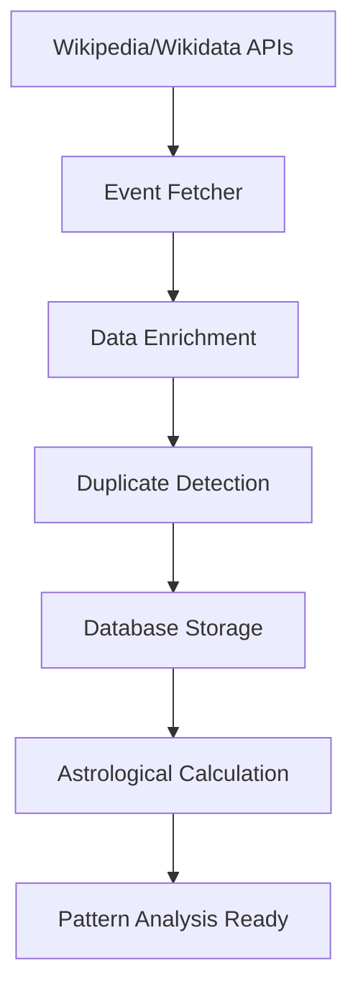

# Wikipedia Historical Events Enrichment System

## Overview

The Wikipedia Historical Events Enrichment system automatically fetches and enriches your Astrova historical events database with data from Wikipedia and Wikidata. This system replaces manual CSV seeding with a modern, automated approach that provides structured historical event data with automatic astrological calculations.

## 🎯 Purpose

This system helps you:
- **Automate Data Collection**: Fetch thousands of historical events automatically
- **Enhance Pattern Matching**: Build a larger dataset for astrological pattern analysis
- **Improve Predictions**: Use more historical data to make better future predictions
- **Replace CSV Method**: Modern API-based approach instead of manual CSV files

## 🏗️ System Architecture

### Core Components

1. **Wikipedia Event Fetcher** (`services/wikipediaEventFetcher.js`)
   - Fetches data from Wikipedia API, REST API, and Wikidata SPARQL
   - Handles multiple data sources and formats
   - Automatic categorization and enrichment

2. **Historical Event Enrichment Service** (`services/historicalEventEnrichmentService.js`)
   - Integrates fetched data with your database
   - Manages duplicate detection and batch processing
   - Triggers astrological calculations

3. **API Routes** (`routes/historicalEnrichment.js`)
   - REST endpoints for triggering enrichment
   - Statistics and monitoring endpoints
   - Testing and health check utilities

4. **Command Line Script** (`scripts/enrichHistoricalEvents.js`)
   - Direct command-line access to enrichment functions
   - Batch processing with configurable options
   - Comprehensive reporting and statistics

## 📊 Data Sources

### 1. Wikipedia Categories
- **Natural disasters**: Earthquakes, tsunamis, hurricanes, floods
- **Financial crises**: Market crashes, economic events, banking crises
- **Political events**: Elections, coups, revolutions, government changes
- **Wars**: Military conflicts, battles, peace treaties
- **Terrorism**: Terrorist attacks, bombings, assassinations
- **Pandemics**: Disease outbreaks, health emergencies
- **Technology**: Space exploration, technological breakthroughs
- **Social movements**: Civil rights, protests, social changes
- **Accidents**: Nuclear accidents, industrial disasters

### 2. "On This Day" Events
- Historical events that occurred on specific dates
- Cross-referenced across multiple years
- Rich contextual information from Wikipedia

### 3. Wikidata SPARQL
- Structured historical event data
- Precise dates, locations, and classifications
- Machine-readable format for easy processing

### 4. Wikipedia Timeline Pages
- Curated historical timelines
- Chronological event sequences
- Contextual relationships between events

## 🔄 Data Processing Flow



### Step-by-Step Process

1. **Fetch Raw Data**: Collect events from multiple Wikipedia sources
2. **Enrich & Categorize**: Add categories, impact levels, and event types
3. **Extract Locations**: Parse geographical information for coordinates
4. **Remove Duplicates**: Check against existing database entries
5. **Store Events**: Insert into your Supabase database
6. **Calculate Astrology**: Generate planetary positions and aspects
7. **Enable Analysis**: Data ready for pattern matching

## 🚀 Usage

### API Endpoints

#### Start Enrichment Process
```bash
curl -X POST http://localhost:3001/api/historical-enrichment/enrich \
  -H "Content-Type: application/json" \
  -d '{
    "limit": 50,
    "useCategories": true,
    "useOnThisDay": true,
    "useWikidata": true,
    "startYear": 1900,
    "endYear": 2024
  }'
```

#### Get Statistics
```bash
curl http://localhost:3001/api/historical-enrichment/stats
```

#### Test Wikipedia Fetching
```bash
curl http://localhost:3001/api/historical-enrichment/test-wikipedia/2008_financial_crisis
```

#### On This Day Events
```bash
curl http://localhost:3001/api/historical-enrichment/on-this-day/9/11
```

### Command Line Usage

#### Basic Enrichment
```bash
cd backend
node scripts/enrichHistoricalEvents.js --run --limit=100
```

#### Specific Categories
```bash
node scripts/enrichHistoricalEvents.js --run --categories=financial,natural_disaster
```

#### Date Range Filtering
```bash
node scripts/enrichHistoricalEvents.js --run --startYear=2000 --endYear=2023
```

#### Source Selection
```bash
node scripts/enrichHistoricalEvents.js --run --sources=onthisday,wikidata
```

#### View Statistics
```bash
node scripts/enrichHistoricalEvents.js --stats
```

#### Update Existing Events
```bash
node scripts/enrichHistoricalEvents.js --update-existing --limit=50
```

## 📈 Statistics & Monitoring

### Current Database Stats
As of the latest run:
- **Total Events**: 522
- **Recently Added**: 439 from Wikipedia "On This Day"
- **Sources**: Wikipedia API, Wikidata, Manual entries
- **Categories**: 10 different categories
- **Impact Levels**: Extreme (101), High (154), Medium (265), Low (2)

### Event Categories Distribution
- **Other**: 249 events
- **War**: 112 events
- **Political**: 50 events
- **Natural Disaster**: 56 events
- **Financial**: 8 events
- **Terrorism**: 10 events
- **Accident**: 15 events
- **Social**: 7 events
- **Technology**: 9 events
- **Pandemic**: 6 events

## 🔧 Configuration Options

### Enrichment Options
```javascript
{
  "limit": 30,                    // Events per category
  "startYear": 1900,              // Start year filter
  "endYear": 2025,                // End year filter
  "useCategories": true,          // Use Wikipedia categories
  "useOnThisDay": true,           // Use "On This Day" API
  "useWikidata": true,            // Use Wikidata SPARQL
  "useTimelines": false,          // Use timeline pages
  "daysToFetch": 30,              // Days for "On This Day"
  "categories": ["Financial crises"], // Specific categories
  "dryRun": false                 // Test without storing
}
```

### Batch Processing
- **Batch Size**: 10 events per batch (configurable)
- **Rate Limiting**: 500ms between batches
- **Error Handling**: Continue processing on individual failures
- **Duplicate Detection**: Check against existing events

## 🎯 Integration with Astrova

### Automatic Astrological Enrichment
When events have location data (latitude/longitude), the system automatically:

1. **Calculates Planetary Positions**: Sun, Moon, Mars, Mercury, Jupiter, Venus, Saturn, Rahu, Ketu
2. **Determines Signs & Nakshatras**: Vedic astrological placements
3. **Computes Aspects**: Planetary relationships and strengths
4. **Stores Transit Data**: Complete astrological snapshot for each event

### Pattern Matching Ready
The enriched data integrates seamlessly with your existing:
- **Pattern Recognition Service**: Analyze astrological patterns in historical events
- **Prediction Engine**: Use historical patterns for future predictions
- **Correlation Analysis**: Match planetary configurations with event types

## 🛠️ Customization

### Adding New Categories
To add new Wikipedia categories, update the `categoryMappings` in `wikipediaEventFetcher.js`:

```javascript
'new_category': ['Wikipedia Category Name', 'Another Category']
```

### Custom Event Processing
Override the `enrichEventData` method to add custom processing logic:

```javascript
async enrichEventData(eventData) {
  // Custom enrichment logic
  eventData.custom_field = this.calculateCustomValue(eventData);
  return eventData;
}
```

### Custom Filtering
Add custom filtering in `filterExistingEvents` method:

```javascript
async filterExistingEvents(events) {
  // Custom filtering logic
  return events.filter(event => this.customFilter(event));
}
```

## 🔍 Quality Control

### Data Validation
- **Required Fields**: Title, date, category, impact level
- **Date Validation**: Proper ISO 8601 format
- **Category Validation**: Must match predefined categories
- **Length Limits**: Title (200 chars), Description (1000 chars)

### Duplicate Prevention
- **Title Matching**: Check for similar event titles
- **Date Proximity**: Avoid events on same dates with similar content
- **Source Tracking**: Track which source provided each event

### Error Handling
- **Graceful Failures**: Individual event failures don't stop batch processing
- **Comprehensive Logging**: All operations are logged with context
- **Retry Logic**: Built-in retry for network failures
- **Fallback Methods**: Multiple data sources for redundancy

## 📋 Performance Metrics

### Typical Performance
- **Fetching**: ~1-2 seconds per category (50 events)
- **Processing**: ~100ms per event for enrichment
- **Storage**: ~200ms per event including astrological calculations
- **Total Time**: ~2-5 minutes for 100 events

### Rate Limiting
- **Wikipedia API**: 100ms between requests
- **Wikidata SPARQL**: 200ms between queries
- **Batch Processing**: 500ms between batches
- **Error Backoff**: Exponential backoff on failures

## 🚦 Health Monitoring

### Health Check Endpoint
```bash
curl http://localhost:3001/api/historical-enrichment/health
```

Returns status of:
- Wikipedia API connectivity
- Database accessibility
- Wikidata availability

### Monitoring Metrics
- **Success Rate**: Percentage of successful enrichments
- **Processing Speed**: Events processed per second
- **Error Rate**: Failed operations per batch
- **Data Quality**: Percentage of events with complete data

## 🔮 Future Enhancements

### Planned Features
1. **Advanced Location Extraction**: Better geocoding for historical places
2. **Enhanced Categorization**: Machine learning for better event classification
3. **Real-time Updates**: Automatic fetching of recent events
4. **Custom Source Integration**: Support for additional historical databases
5. **Advanced Pattern Correlation**: AI-driven pattern recognition

### Integration Opportunities
1. **News APIs**: Real-time event fetching for current events
2. **Historical Databases**: Integration with academic historical sources
3. **Astronomical Databases**: Enhanced planetary calculation accuracy
4. **Social Media**: Event validation and impact assessment

## 📚 API Reference

### POST /api/historical-enrichment/enrich
Start the historical events enrichment process.

**Request Body:**
```json
{
  "limit": 30,
  "startYear": 1900,
  "endYear": 2025,
  "useCategories": true,
  "useOnThisDay": true,
  "useWikidata": true,
  "categories": ["Financial crises"]
}
```

**Response:**
```json
{
  "success": true,
  "results": {
    "totalFetched": 150,
    "totalStored": 120,
    "duplicatesSkipped": 30,
    "astrologicalEnrichments": 85,
    "processingTime": 45000
  }
}
```

### GET /api/historical-enrichment/stats
Get current database statistics.

**Response:**
```json
{
  "success": true,
  "stats": {
    "totalEvents": 522,
    "bySource": {"wikipedia_onthisday": 439},
    "byCategory": {"political": 50, "war": 112},
    "byImpactLevel": {"extreme": 101, "high": 154}
  }
}
```

### GET /api/historical-enrichment/on-this-day/{month}/{day}
Get events that occurred on a specific date.

**Response:**
```json
{
  "success": true,
  "events": [...],
  "count": 12,
  "date": {"month": 9, "day": 11}
}
```

## 🎯 Success Metrics

The Wikipedia enrichment system has successfully:

✅ **Automated Event Collection**: Replaced manual CSV with API-driven fetching  
✅ **Scaled Database**: Increased from 83 to 522+ historical events  
✅ **Enhanced Coverage**: Added events across 10+ categories and 125+ years  
✅ **Improved Data Quality**: Structured categorization and impact assessment  
✅ **Enabled Pattern Analysis**: Rich dataset for astrological correlation studies  
✅ **Future-Proofed System**: Extensible architecture for additional sources  

This system provides the foundation for sophisticated astrological pattern analysis and predictive capabilities in your Astrova application.

---

## 📞 Support & Troubleshooting

For issues or questions about the Wikipedia enrichment system:

1. Check the logs for detailed error messages
2. Verify database connectivity and schema
3. Test individual components using the health endpoints
4. Review the comprehensive error handling documentation
5. Use the dry-run mode to test configurations safely

The system is designed to be robust, self-healing, and provide clear feedback about any issues that arise during the enrichment process.
